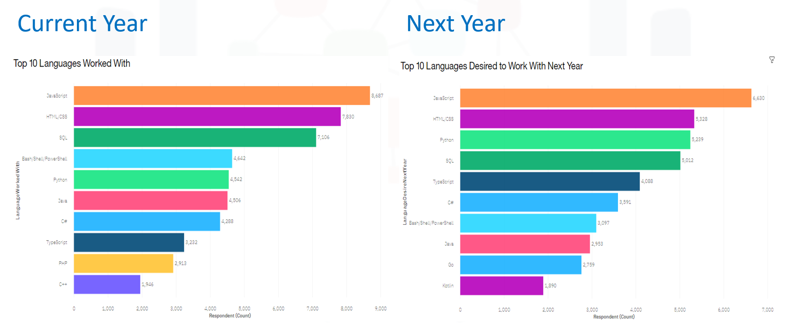
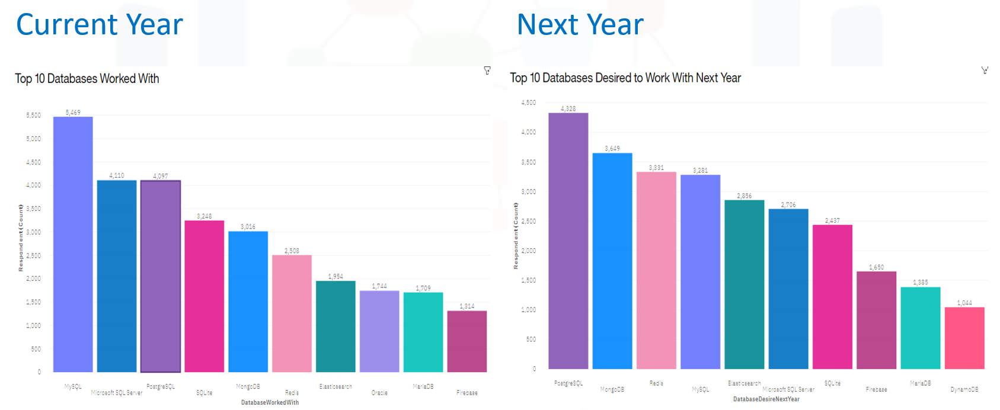

# IBM Data Analyst Professional Certificate Capstone Project

## Table of Contents
1. [Introduction](#introduction)
2. [Insights](#insights)
3. [Data Collection](#data-collection)
4. [Data Cleaning](#data-cleaning)
5. [Data Exploration](#data-exploration)
6. [Visualization](#visualization)
7. [Conclusion](#conclusion)

## Introduction
In this project, I assumed the role of a Data Analyst in an IT firm seeking to understand the current trends in technology amongst developers. The analyst covers the current technologies, desired technologies and demographic information of developers.

The aim of this analysis is to make data-driven decisions regarding which technologies the company should invest for training current developers within the firm and even potential hires. Additionally, location and demographic data of developers in analyzed to further aid in training efforts and during the hiring process.

The data for analysis was gathered from various sources by **API and webscraping using Python**. The gathered data was then cleaned and prepared for analysis which included statistical analysis, correlation and initial charts using Python libraries. Finally, the data was loaded in **IBM Cognos** to create the final dashboard visualization.

## Insights
1. Web development languages continue in their popularity, eg. JavaScript, HTML/CSS.
2. Increased popularity in Python indicative of a move towards Data Science, AI and Machine Learning.
3. Increased interest in languages used in mobile web development such as Kotlin.

4.  Significant decrease in interest in MySQL and Microsoft SQL Server while increased interest in modern databases such as PostgreSQL and MongoDB.
5. No longer any significant interest in Oracle.

6. Wide gender disparity in developers with 93.5% being men, and only 6.5% women.
7. Concentration of developer talent in USA and India.

**For more information, please read the [full presentation](https://github.com/shawnakpatten/IBM-Data-Analyst-Capstone-Project/blob/main/6_Presentation_%20Developer%20Survey%20Analysis.pdf).**

## Data Collection
The data for this analysis was gathered from three sources:
1. **Jobs API**: a modified subset of the [Jobs On Naukri.com](https://www.kaggle.com/datasets/promptcloud/jobs-on-naukricom) dataset available on Kaggle.
2. **Programming Languages and Annual Salary**: scraped from [IBM](https://cf-courses-data.s3.us.cloud-object-storage.appdomain.cloud/IBM-DA0321EN-SkillsNetwork/labs/datasets/Programming_Languages.html).
3. **Stack Overflow Developer Survey**

## Data Cleaning
The data cleaning process included checking for and removing duplicates, imputing missing values and normalizing the salary fields **CompFreq and CompTotal** columns by calculating the **annual salary** which would make for better comparison across developers.

## Data Exploration
In the data exploration phase, distribution plots were created using Python to better visualize the data. Box plot was used to visualize outliers, there upper and lower bounds were determined which further aided in the removal of outliers which would skew the results of the analysis. Finally, the correlation between columns was examined.

## Visualization
The final visualizations and dashboards were created using IBM Cognos Analytics. The dashboards and charts created were:
1. **Current Technology Usage**
   - Bar chart showing **Top 10 Languages Worked With**
   - Column chart showing **Top 10 Databases Worked With**
   - Word cloud chart showing **Platforms Worked With**
   - Hierarchy bubble chart showing **Top 10 Web Frameworks Worked With**
2. **Future Technology Trend**
   - Bar chart showing **Top 10 Languages Desired Next Year**
   - Column chart showing **Top 10 Databases Desired Next Year**
   - Tree map chart showing **Platforms Desired Next Year**
   - Hierarchy bubble chart showing **Top 10 Web Frameworks Desired Next Year**
3. **Demographics**
   - Pie chart showing **Respondents classified by Gender**
   - Map chart showing **Respondent Count for Countries**
   - Line chart showing **Respondent Count by Age**
   - Stacked bar chart showing **Respondent Count by Gender, classified by Formal Education Level**

## Conclusion
This project explored trends in current and future technology (programming languages, databases, platforms and frameworks) amongst developers. It also explored the demographics (gender, age and location) for said developers.

The analysis showed continued focus on web development and it's associated technologies. It also showed a localization of developer talent in India and the USA, so the IT firm can invest in local talent or outsource to those countries. There was a wide gender disparity which showed low involvement of women in the developer space and such investments can be made in introducing more women to the field.
